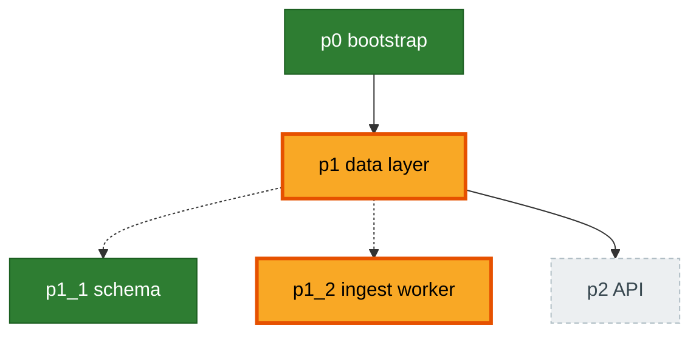

# PLAN.md — phase map (TEMPLATE)

> The **strategic** view: phases, gates, and the dependency graph — where the whole journey stands.
> The **tactical** board is `TASKS.md` (`## Now` feeds from the wip phase's gate); never duplicate its
> checkboxes here. Updated at **ritual points only**: `/keel-plan` creates/revises the map, `/keel-handover` flips
> statuses + refreshes *Current focus*, `/keel-phase-review` turns a finished phase's gate green. The
> SessionStart hook cross-checks table ↔ diagram ↔ TASKS and warns on drift. **Not `@`-imported**
> (zero always-on context cost) — read it when orienting. **Cap ~150 lines / ~30 nodes** (split
> per-phase diagrams beyond that).

_Current focus: <p1_2 — one line on what is actively being pushed>_

<!-- REPLACE this example at bootstrap (run /keel-plan) -->

## Phase table (SOURCE OF TRUTH — the diagram below is regenerated from this)

Statuses: `todo` → `wip` → `done` (a fix on a done phase goes to the Fix log — never flip done back).
`after` = dependency (comma-separated ids). A phase is `done` only when its gate passed `/keel-phase-review`.
Nodes are **product** phases (what ships); one-time meta/tooling work — a mid-project tool adoption, a
CVE sweep, a pure refactor — goes to an ADR / the Fix log, not a node (an `after` on a meta stub forks
the graph on something that never ships). This file holds ONLY the latest plan — phases dropped by a
re-plan are removed, not marked (failures live in `LESSONS.md`; git history keeps every earlier plan).

| id | phase | status | after | gate (done-when) | since |
|---|---|---|---|---|---|
| p0 | Bootstrap | done | - | tailoring applied + recorded | <YYYY-MM-DD> |
| p1 | Data layer | wip | p0 | ingest e2e green | <YYYY-MM-DD> |
| p1_1 | Schema | done | - | migrations apply clean | <YYYY-MM-DD> |
| p1_2 | Ingest worker | wip | p1_1 | e2e ingest test green | <YYYY-MM-DD> |
| p2 | API | todo | p1 | CRUD + auth smoke green | |

## Diagram (regenerated from the table — do NOT hand-edit between the markers)

Full palette + node/label rules: the `/keel-plan` skill owns the canonical spec (it regenerates this
block). In short: node id = the phase id (`p1`, not "Phase 1"); **order is the arrows, not the number**;
`done` green · `wip` amber+thick · `todo` grey+dashed · `blocked` red (reserved). Mermaid safety (GitHub
~v10): ids `[a-z0-9_]`, one node per line, `"quoted"` ASCII labels, no emoji / unquoted `()` / lowercase
`end`; `-->` depends-on, `-.->` contains; never `%%{init}%%`.

> yeşil done · **amber** wip · gri-kesik todo · kırmızı blocked — sıra OKLARDA, numarada değil.

<!-- KEEL_PLAN_DIAGRAM_BEGIN -->

<!-- KEEL_PLAN_DIAGRAM_END -->

## Fix log (after completion too: every update/bugfix maps to the phase it touched)

| date | fix | phase |
|---|---|---|
| <YYYY-MM-DD> | <what was fixed, one line> | <p1_2> |
