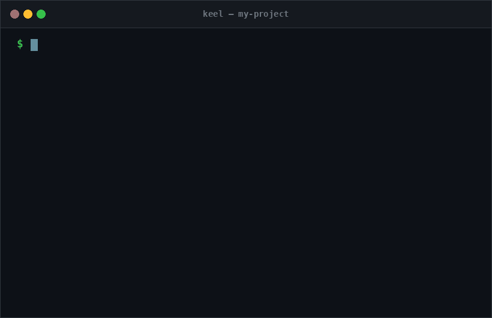
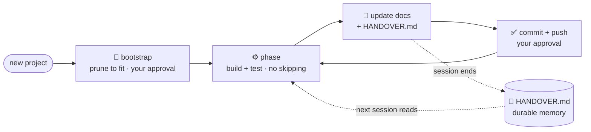

# Keel — Claude Code Starter Kit

*Like a ship's keel keeps a vessel on course, **Keel** keeps Claude Code (or any LLM) on course:
a discipline + security starter kit that makes your project consistent, traceable, and safe —
no drift across sessions, from the very first one.*

<p align="center">
  
</p>

**Requires:** [Claude Code](https://claude.com/claude-code). The `.claude/` layer (permissions, hooks,
skills) is Claude-Code-native; the docs and discipline (`rules.md`, ADRs, `HANDOVER.md`, security guide)
are tool-agnostic and useful with any agent.

## Quick start
```bash
# 1) clone Keel as your new project, then start your own git history
git clone https://github.com/muratsilahtaroglu/claude-code-starter-kit.git my-project
cd my-project && rm -rf .git && git init
# 2) in Claude Code, let it tailor the template to THIS project before coding:
#    "Read CLAUDE.md, then run the bootstrap: prune what this project doesn't need and plan."
```
Not every project needs the whole template — the bootstrap prunes it to fit (with your approval).
See **How to use** below. **Already have a project?** Don't `rm -rf .git` — see
[Adopting into an existing project](#adopting-into-an-existing-project-brownfield).

> **Purpose:** When starting a new project (you or your teammates), give Claude Code this folder as a
> **template**. The generic "working discipline" files inside help set up the project from day one as
> **professional, traceable, and secure**. No file contains a project name or project-specific detail —
> fill in the placeholders.

## The loop (why it doesn't drift)

The context window is volatile RAM; the repo is durable disk. Every phase writes what it did into
`HANDOVER.md` + the docs, so the next session (even after 10+ compactions) picks up without drift.

## Two layers: guidance + enforcement
Rules alone can be ignored; Keel also wires the discipline into Claude Code's **native, deterministic** layer.

| Layer | Where | Enforced? |
|---|---|---|
| **Guidance** | `rules.md`, ADRs, `HANDOVER.md` | advisory — the working discipline |
| **Always in context** | `CLAUDE.md` `@`-imports `rules.md` + `HANDOVER.md` | auto-loaded every session |
| **Permissions** | `.claude/settings.json` | denies reading `.env`/secrets · asks before `git push` |
| **Hooks** | `.claude/hooks/` | blocks `rm -rf` · force-push · staging `.env` · pipe-to-shell |

## How to use
1. Copy the contents of this folder into the root of the new project.
2. **Bootstrap tailoring (rules.md §0.0):** have the AI first *understand the project*, then propose
   (a) which template parts are unnecessary for this project and should be removed (with reasons), and
   (b) which layout profile from `docs/layouts.md` (ML, service/API, CLI, ...) to instantiate.
   **Nothing is removed or added without user approval.** Not every project needs the whole template.
3. Fill in the `<...>` placeholders in `CLAUDE.md`, `.env.example`, and `docs/architecture.md`.
4. Choose and add a `LICENSE` before the first push (a folder with no license is "all rights reserved").
5. Tell Claude Code: *"First read CLAUDE.md, then plan."* (CLAUDE.md `@`-imports `rules.md` + `HANDOVER.md`.)
6. Follow the discipline in `rules.md` and proceed in phases; update docs + `HANDOVER.md` at the end of
   each phase, then commit + push with approval.

## Adopting into an existing project (brownfield)
Keel isn't only for new projects — you can bring an **already-in-progress** project under its discipline.
The kit is *overlaid, never dumped on top*: **non-destructive is the hard rule** (rules.md §0, Mode B).
```bash
# clone the kit somewhere ELSE — never touch your project's .git
git clone https://github.com/muratsilahtaroglu/claude-code-starter-kit.git /tmp/keel
# add ONLY the files you don't already have (existing files are kept, never overwritten):
rsync -av --ignore-existing /tmp/keel/ /path/to/your-project/ --exclude '.git'
```
Then, in Claude Code, run **`/adopt`** (or: *"Adopt Keel into THIS project — don't overwrite my files, add
only what's missing, back-fill `docs/architecture.md` + `HANDOVER.md` from the current code, merge conflicts
by showing me a diff first, and propose the plan before changing anything."*). `/adopt` inventories every
path as **add · merge · defer**, reverse-engineers the docs from your real code, and migrates security
(rules.md §7) gradually — without breaking a working build.

## Contents (all generic / project-agnostic)
```text
claude-code-starter-kit/
│
├── CLAUDE.md                 # project constitution — Claude reads it first (@-imports rules + handover)
├── rules.md                  # working discipline: docs · tests · security · git · research
├── HANDOVER.md               # cumulative session memory (done · tried-failed · latest · next)
├── README.md                 # this file
├── CONTRIBUTING.md           # how to contribute to the kit itself
├── LICENSE                   # MIT
│
├── .claude/                  # ⚙️  Claude Code enforcement layer (deterministic, not just advice)
│   ├── settings.json         #     permissions: deny reading secrets · ask before push
│   ├── hooks/                #     block-dangerous.sh (rm -rf · force-push · .env) + handover reminder
│   └── skills/               #     invokable workflows: /handoff · /phase-review · /research · /adopt
│
├── docs/                     # 📚 long-form documentation
│   ├── architecture.md       #     live module map (updated on every structural change)
│   ├── security.md           #     supply-chain security guide (pin · hash · non-root · .pth · CI)
│   ├── layouts.md            #     per-project layout profiles (ML · service/API · CLI)
│   ├── user_manual.md        #     end-user guide skeleton
│   ├── assets/               #     README media (demo GIF)
│   └── adr/                  #     architecture decision records (template + index)
│
├── requirements/             # 📦 all dependency manifests (see requirements/README.md)
│   ├── base.txt · base.lock  #     runtime deps — pinned (==) + hash-locked
│   └── dev.txt  · dev.lock   #     dev tooling — never enters the prod image
│
├── config/                   # non-secret parameters per env (local.yaml · prod.yaml)
├── prompts/                  # versioned reusable prompts (code never embeds prompt strings)
├── tests/                    # unit · integration · e2e · fixtures
├── scratch/                  # throwaway experiments (probes · one_off · experiments)
├── reports/                  # generated reports
├── research/                 # opt-in external research trail
│   └── github · articles · linkedin · huggingface · web   → findings.md per source
│
├── .github/                  # CI + PR template
│   ├── workflows/ci.yml      #     hash-verify · pip-audit · .pth scan on every PR/push
│   └── PULL_REQUEST_TEMPLATE.md  # Definition-of-Done checklist (mirrors rules.md)
│
├── Dockerfile · .dockerignore · docker-compose.yml   # multi-stage, non-root container skeleton
├── Makefile                  # runnable targets: setup · test · lint · lock · audit
├── pyproject.toml            # tool config only: ruff (+ security lint S) + pytest
├── .pre-commit-config.yaml   # gitleaks + .env guard + hygiene hooks
└── .editorconfig · .env.example · .gitignore
```

## Philosophy (why this discipline?)
- **Fit the project, don't force the template:** the bootstrap step (rules.md §0.0) prunes unneeded
  parts and instantiates the right layout profile — always with user approval.
- **Traceability:** every decision goes into an ADR, every structural change into `architecture.md`,
  every session into `HANDOVER.md`. The project stays stable even after 10+ compactions.
- **Order:** throwaway code stays in `scratch/`, the main tree stays clean.
- **Security from day one:** dependency pinning + hashing + non-root + secret hygiene from the start.
- **Enforced, not just advised:** the discipline is wired into Claude Code's native layer (see the
  table above) — rules are guidance; permissions and hooks are enforced.
- **Controlled progress:** phases are not skipped; each phase ends with a working product + an
  approved commit/push.
